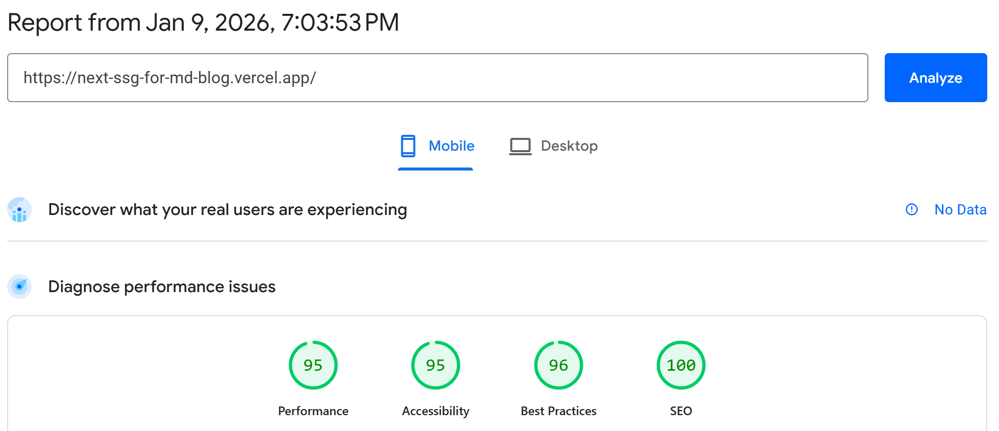
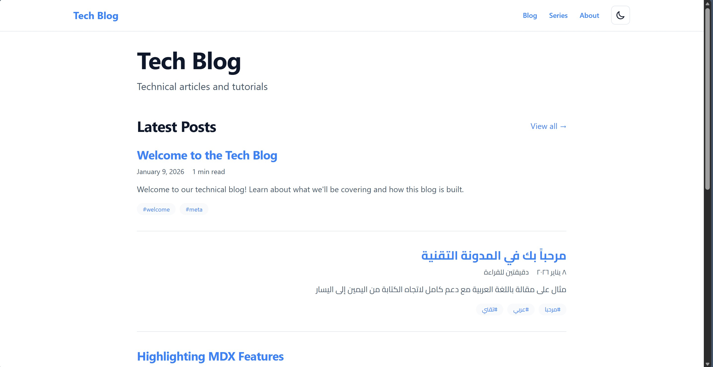
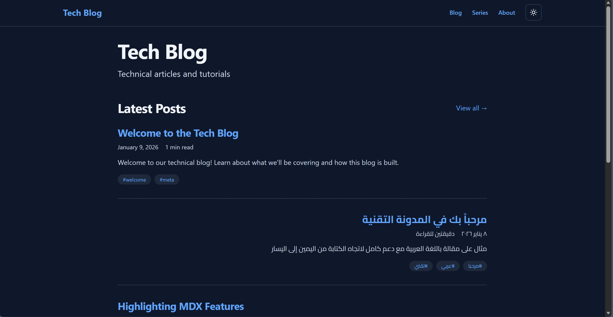
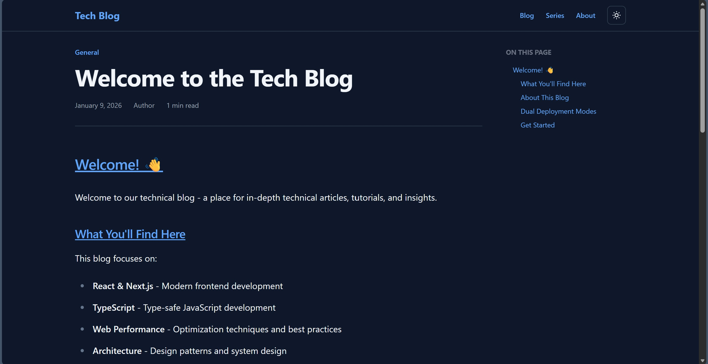
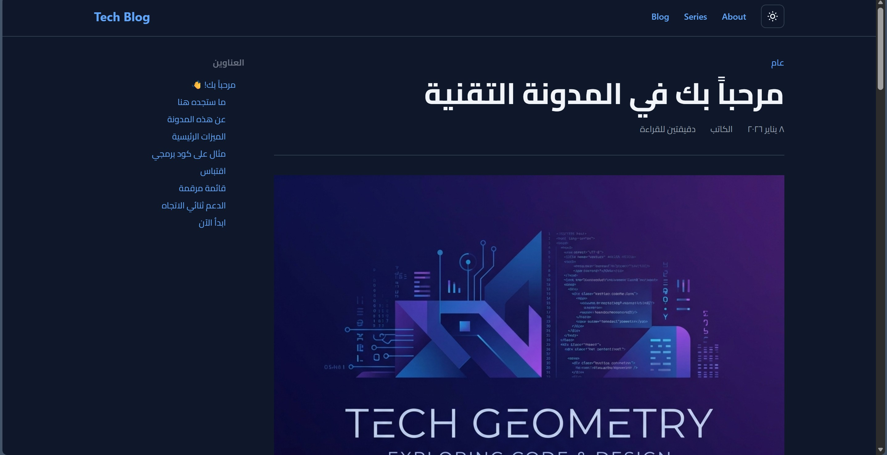
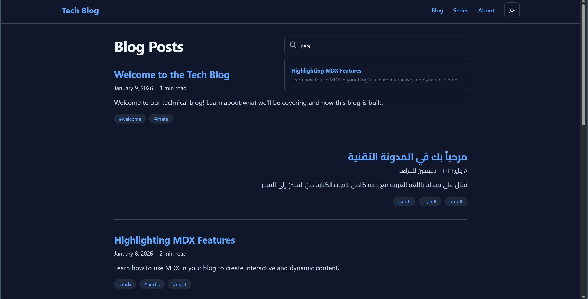
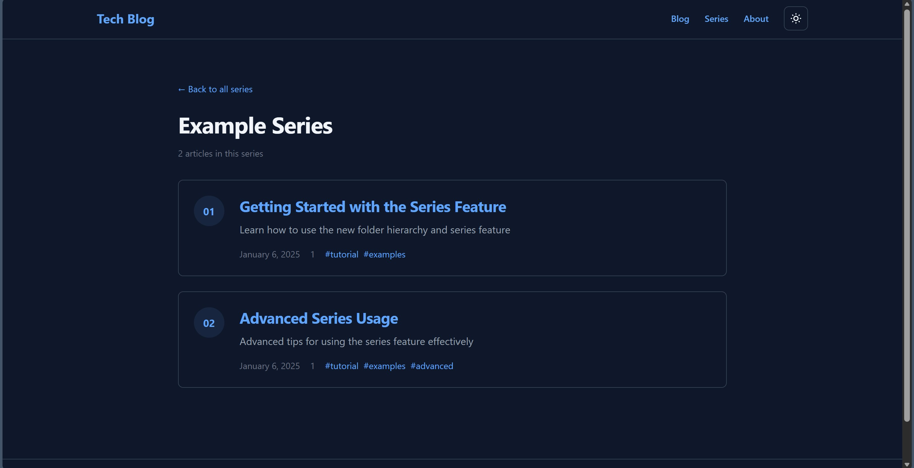

# Next.js SSG Blog Framework

[](https://next-ssg-for-md-blog.vercel.app/)
[](LICENSE)
[](https://nextjs.org/)
[](https://www.typescriptlang.org/)
[](https://tailwindcss.com/)

> **A modern, production-ready blog framework** built with Next.js 16. Fork it, add your content, and you're ready to publish!

🔗 **[Live Demo](https://next-ssg-for-md-blog.vercel.app/)** | 📖 **[Documentation](./docs/)** | ⚖️ **[Attributions](./ATTRIBUTIONS.md)**

🚀 **[Quick Start](#-quick-start-5-minutes-to-your-blog)**

---

## 🎯 What Is This?

This is a **blog framework/template**, not a finished blog. Think of it like:

- 🏗️ **Framework**: The code that powers the blog (you don't need to touch this)
- 📝 **Your Content**: Blog posts and assets (this is what you customize)

**You customize:** `/content` (your posts) + `/public` (your assets) + `config.ts` (your settings)  
**We provide:** Everything else works out of the box!

👉 **See [CUSTOMIZATION.md](./CUSTOMIZATION.md) for the complete customization guide**

---

## 💡 Why I Built This

### The Motivation

I needed a specific combination of features that I couldn't find in a single existing framework:

- **Simplicity**: I wanted to start writing immediately without complex configuration.
- **RTL Support**: I needed first-class support for Arabic content.
- **Embeddability**: I needed to render blog posts inside other applications (dashboards), not just as a standalone site.
- **Ownership**: I wanted to keep my content in standard Markdown/MDX to avoid lock-in.

### The Solution

A **minimalist blog framework** that:

✅ Works out of the box with sensible defaults  
✅ Fully static (no server required) for maximum performance  
✅ Pure markdown/MDX - own your content forever  
✅ Customizable everything via simple config files  
✅ Modern tech stack (Next.js 16, TypeScript, Tailwind v4)  
✅ **Special Feature**: Dual deployment modes (standalone + embeddable fragments)  
✅ **Special Feature**: First-class RTL language support

### Who Is This For?

- 💻 **Developers** who want a simple, customizable technical blog
- 📝 **Writers** who want to write in Markdown without overhead
- 🌍 **Multilingual authors** needing robust RTL support
- 🏢 **Teams** needing to embed blog content into existing apps
- 🎓 **Educators** organizing content into sequential series

---

## ⚡ Performance Metrics

### Lighthouse Scores (Production Build)



```
🟢 Performance:   95/100
🟢 Accessibility: 95/100
🟢 Best Practices: 96/100
🟢 SEO:          100/100
```

### Build Metrics

- **Build Time**: ~17.5 seconds (9 posts)
  - Measured using `Measure-Command { cmd /c "npm run build:standalone" }` on Windows
- **Bundle Size**: ~195 kB total
- **Largest Contentful Paint**: < 2.4s

### Why So Fast?

- ✅ **100% Static**: No server-side rendering overhead
- ✅ **Optimized Images**: Automatic image optimization
- ✅ **Code Splitting**: Only load what you need
- ✅ **Tree Shaking**: Unused code eliminated
- ✅ **Minimal JavaScript**: Static HTML with progressive enhancement

---

## ✨ Features

### 🚀 Core Functionality

- ✅ **Markdown & MDX Support** - Write content in `.md` or `.mdx` files
- ✅ **Static Site Generation** - Pre-rendered HTML for optimal performance
- ✅ **Search Functionality** - Fast, client-side search with Fuse.js
- ✅ **Series Support** - Group related posts into series
- ✅ **Syntax Highlighting** - Beautiful code blocks with highlight.js
- ✅ **GitHub Flavored Markdown** - Tables, task lists, and more
- ✅ **Frontmatter Support** - Rich metadata (title, date, tags, author, etc.)
- ✅ **Reading Time Estimation** - Automatic calculation
- ✅ **Table of Contents** - Auto-generated from headings
- ✅ **Draft Posts** - Hide posts in production with `draft: true`

### 🎨 Design & UX

- ✅ **Dark & Light Mode** - Automatic theme switching with persistence
- ✅ **Responsive Design** - Mobile-first approach
- ✅ **Modern Typography** - Tailwind Typography plugin
- ✅ **Fully Customizable Theme** - Easy color customization via CSS variables
- ✅ **Smooth Transitions** - Polished user experience

### 🌍 Key Differentiators

#### 1. **Triple Deployment Modes** ⭐

- **Standalone Website** - Full-featured blog with navigation system
- **Embeddable Content** - Pure HTML fragments for custom CSS integration
- **Bootstrap-Compatible** - Drop-in ready fragments for Bootstrap/MDB projects

**Use Case**: Build your blog once, embed articles anywhere (corporate dashboards, learning management systems, Bootstrap apps).

#### 2. **First-Class RTL Support** ⭐

- ✅ Native Arabic and RTL language support
- ✅ Per-post language control
- ✅ Automatic direction detection
- ✅ RTL-aware layouts

**Use Case**: Create multilingual blogs or Arabic-first content without complex CSS overrides.

---

## 📸 Screenshots

### Light & Dark Mode

| Light Mode                                                        | Dark Mode                                                       |
| ----------------------------------------------------------------- | --------------------------------------------------------------- |
|  |  |

### Key Features

<details>
<summary><b>👀 Expand to see more screenshots</b></summary>

#### Blog Post with Table of Contents



#### First-Class RTL Support (Arabic)



#### Instant Search



#### Series Navigation



</details>

---

## 📊 Comparison with Other Frameworks

| Feature               | This Framework   | Gatsby      | Hugo      | Jekyll     | Astro            |
| --------------------- | ---------------- | ----------- | --------- | ---------- | ---------------- |
| **Focus**             | Simplicity + RTL | Ecosystem   | Speed     | Simplicity | Performance      |
| **Setup Time**        | < 5 min          | ~30 min     | ~15 min   | ~15 min    | ~10 min          |
| **TypeScript First**  | ✅               | ❌          | ❌        | ❌         | ✅               |
| **MDX Support**       | ✅               | ✅ (plugin) | ❌        | ❌         | ✅               |
| **RTL Support**       | ✅ Native        | ❌ Manual   | ❌ Manual | ❌ Manual  | ❌ Manual        |
| **Embeddable Mode**   | ✅ Built-in      | ❌          | ❌        | ❌         | ❌               |
| **Series Navigation** | ✅               | ❌          | ❌        | ❌         | ❌               |
| **Dark Mode**         | ✅ Built-in      | ❌ Manual   | ❌ Manual | ❌ Manual  | ✅ (some themes) |
| **Search**            | ✅ Client-side   | ✅ (plugin) | ❌        | ❌         | ❌ Manual        |
| **Bundle Size**       | ~70 kB           | ~200 kB     | ~50 kB    | ~100 kB    | ~80 kB           |
| **Learning Curve**    | Low              | High        | Medium    | Low        | Medium           |

### When to Choose This Framework?

- ✅ You need **RTL support** out of the box
- ✅ You need **embeddable content** for other apps
- ✅ You prefer a **Next.js/React** stack
- ✅ You value **simplicity** over a massive plugin ecosystem

---

## 🚀 Quick Start (5 Minutes to Your Blog)

### 1. Fork & Clone

```bash
# Fork this repo on GitHub, then clone your fork
git clone https://github.com/YOUR-USERNAME/next-ssg-for-md-blog.git
cd next-ssg-for-md-blog
```

### 2. Install Dependencies

```bash
npm install
```

### 3. Customize Your Blog

```bash
# Edit site configuration
nano config.ts
```

```typescript
export const config = {
  site: {
    name: process.env.SITE_NAME || "Your Blog Name", // ⬅️ CHANGE THIS
    description: process.env.SITE_DESCRIPTION || "Your description", // ⬅️ CHANGE THIS
    url: process.env.SITE_URL || "https://yourdomain.com", // ⬅️ CHANGE THIS
    author: "Your Name", // ⬅️ CHANGE THIS
  },
  language: "default", // 'ar' for RTL, 'ltr' for LTR, 'default' for auto-detect
  // ...
};
```

### 4. Add Your Content

```bash
# Remove example posts (or keep them as reference)
rm -rf content/blog/*

# Create your first post
nano content/blog/my-first-post.md
```

```markdown
---
title: "My First Post"
date: "2026-01-07"
author: "Your Name"
tags: ["welcome"]
description: "My first blog post!"
---

## Hello World!

This is my first post using this awesome blog framework!
```

### 5. Run & Preview

```bash
npm run dev
```

Visit `http://localhost:3000` - You're live! 🎉

### 6. Deploy

```bash
# Build for production
npm run build

# Deploy to Vercel, Netlify, or any static host
```

---

## 📂 What to Customize

### 🔴 **MUST CUSTOMIZE** (3 things)

1. **`/content/blog/`** - Your blog posts (`.md` files)
2. **`/public/`** - Your images, favicon, assets
3. **`config.ts`** - Your blog name, description, URL

### 🟡 **SHOULD CUSTOMIZE** (Make it yours)

4. **`src/app/globals.css`** - Theme colors (line 16+)
5. **`components/layout/Header.tsx`** - Navigation links

### 🟢 **CAN CUSTOMIZE** (Optional)

6. Fonts, metadata, advanced features

👉 **Full customization guide:** [CUSTOMIZATION.md](./CUSTOMIZATION.md)

---

## 🏗️ Project Structure

```
next-ssg-for-md-blog/
│
├── 📝 CUSTOMIZE THESE (Your Content)
│   ├── content/              # Your blog posts & pages
│   │   ├── blog/            # .md files for blog posts
│   │   └── pages/           # .md files for static pages
│   ├── public/              # Images, favicon, static assets
│   └── config.ts            # Blog configuration
│
├── 🎨 CUSTOMIZE IF NEEDED (Styling)
│   ├── src/app/globals.css  # Theme colors
│   └── components/layout/   # Header, footer, navigation
│
└── ⚙️ DON'T MODIFY (Framework - works out of box)
    ├── src/app/             # Next.js pages & routing
    ├── components/blog/     # Blog components
    ├── lib/                 # Markdown processing, utilities
    ├── types/               # TypeScript types
    └── next.config.ts       # Next.js configuration
```

---

## 📝 Creating Content

### Blog Post Template

Create a new file in `content/blog/your-post-name.md` or `content/blog/your-post-name.mdx`:

````markdown
---
title: "Your Post Title"
date: "2026-01-07"
author: "Your Name"
tags: ["tag1", "tag2"]
category: "Category Name"
description: "A brief description for SEO"
language: "ar" # Optional: 'ar' for Arabic/RTL, 'en' for English/LTR
draft: false
---

## Your Content Here

Write your blog post content using markdown...

### Subheadings work great

- Lists are supported
- Including nested lists
  - Like this

Code blocks with syntax highlighting:

```javascript
console.log("Hello, world!");
```
````

And much more!

````

### Frontmatter Reference

| Field         | Type                | Required | Description                |
| ------------- | ------------------- | -------- | -------------------------- |
| `title`       | string              | ✅       | Post title                 |
| `date`        | string (YYYY-MM-DD) | ✅       | Publication date           |
| `author`      | string              | ❌       | Author name                |
| `tags`        | string[]            | ❌       | Post tags                  |
| `category`    | string              | ❌       | Post category              |
| `description` | string              | ❌       | SEO description            |
| `image`       | string              | ❌       | Cover image path           |
| `language`    | string              | ❌       | 'ar' for RTL, 'en' for LTR |
| `draft`       | boolean             | ❌       | Hide in production         |
| `series`      | string              | ❌       | Series name                |
| `seriesOrder` | number              | ❌       | Order in series            |

### RTL Language Support

The blog supports Arabic and other RTL languages. See [docs/RTL_SUPPORT.md](./docs/RTL_SUPPORT.md) for details.

**Quick example:**

```yaml
---
title: "مرحباً بك"
language: "ar" # This post will render in RTL
---
````

---

## 🎨 Customizing Theme

Edit `src/app/globals.css` (around line 16):

```css
@theme {
  /* Change these to your brand colors */
  --color-primary: #3b82f6; /* Links, CTAs */
  --color-accent: #8b5cf6; /* Accents, highlights */
  --color-background: #ffffff; /* Page background */
  --color-surface: #f8fafc; /* Cards, surfaces */
  /* ... more colors ... */
}
```

**Popular themes:**

- **Tech** (current): Blue `#3b82f6` + Purple `#8b5cf6`
- **Nature**: Green `#10b981` + Teal `#14b8a6`
- **Creative**: Pink `#ec4899` + Orange `#f97316`

See full color customization in [CUSTOMIZATION.md](./CUSTOMIZATION.md)

---

## 📦 Building & Deployment

### Development

```bash
npm run dev          # Start dev server (localhost:3000)
```

### Production Build

```bash
# Standalone website (standard mode)
npm run build

# Specialized build modes
npm run build:standalone           # Complete blog site with full pages
npm run build:embeddable          # Pure HTML fragments (custom CSS)
npm run build:embeddable-bootstrap # Bootstrap-compatible fragments
npm run build:both                # Builds standalone + embeddable
npm run build:all                 # Builds all three modes
```

Output: Static files in the `out/` directory.

> [!NOTE]
> **Embeddable Modes**:
>
> - `build:embeddable` - Clean HTML fragments for custom CSS integration
> - `build:embeddable-bootstrap` - Bootstrap 5-compatible fragments with included CSS
>
> See [docs/EMBEDDABLE_FRAGMENTS.md](./docs/EMBEDDABLE_FRAGMENTS.md) and [docs/BOOTSTRAP_EMBEDDABLE.md](./docs/BOOTSTRAP_EMBEDDABLE.md) for details.

To test the **standalone** build locally, you need to serve the files via an HTTP server (e.g., `npx serve out`). The **embeddable** fragments can be viewed directly as they are pure HTML snippets.

### Deploy Anywhere

The blog is pure static HTML/CSS/JS. Deploy to:

- **Vercel** (recommended) - Auto-deploy from GitHub
- **Netlify** - Connect repo, build & publish
- **GitHub Pages** - Free hosting for public repos
- **Cloudflare Pages** - Fast global CDN
- **AWS S3 + CloudFront** - Scalable cloud hosting
- **Any static host** - Just upload the `out/` folder!

### Vercel Deployment (Easiest)

1. Push your repo to GitHub
2. Go to [vercel.com](https://vercel.com)
3. Import your repository
4. Click Deploy
5. Done! ✨

👉 **See [docs/DEPLOYMENT.md](./docs/DEPLOYMENT.md) for a detailed step-by-step guide including Environment Variables.**

---

## 🛠️ Tech Stack

- **Framework:** Next.js 16 (App Router) with Static Site Generation
- **Language:** TypeScript
- **Styling:** Tailwind CSS v4 + Typography plugin
- **Content:** Markdown/MDX with gray-matter frontmatter
- **Syntax Highlighting:** highlight.js
- **Deployment:** Static export (works anywhere)

---

## 📚 Documentation

- **[CUSTOMIZATION.md](./CUSTOMIZATION.md)** - Complete customization guide
- **[docs/RTL_SUPPORT.md](./docs/RTL_SUPPORT.md)** - RTL language configuration guide
- **[docs/SERIES_FEATURE.md](./docs/SERIES_FEATURE.md)** - Guide for creating series
- **[docs/DEPLOYMENT.md](./docs/DEPLOYMENT.md)** - Detailed deployment instructions
- **[docs/EMBEDDABLE_FRAGMENTS.md](./docs/EMBEDDABLE_FRAGMENTS.md)** - Embeddable mode guide
- **[docs/](./docs/)** - Additional guides & documentation

---

## 🎯 Use Cases

This blog framework is perfect for:

- 💻 **Developer Blogs** - Technical tutorials and articles
- 📝 **Personal Blogs** - Share your thoughts and experiences
- 🎨 **Portfolio Sites** - Showcase your work with blog posts
- 📚 **Documentation Sites** - Product docs or knowledge bases
- 🏢 **Company Blogs** - Content marketing and announcements
- 📖 **Learning Journals** - Document your learning journey
- 🌍 **Multilingual Sites** - Arabic, Hebrew, or mixed LTR/RTL content
- 🔧 **Embeddable Content** - Integrate blog posts into dashboards or CMS

---

## 🗺️ Roadmap

### ✅ Phase 1: Core (Complete)

- [x] Markdown/MDX rendering
- [x] Blog post pages
- [x] Homepage with latest posts
- [x] Syntax highlighting
- [x] Dark/light mode
- [x] Responsive design
- [x] Custom theme system
- [x] RTL language support
- [x] Embeddable content mode

### 🔄 Phase 2: Enhanced Features (In Progress)

- [x] Search functionality
- [x] Tag/category filtering
- [x] Series support
- [ ] Related posts
- [ ] RSS feed
- [ ] Sitemap generation
- [ ] Enhanced SEO

### 🔮 Phase 3: Advanced (Future)

- [ ] Comments system (Giscus)
- [ ] Analytics integration
- [ ] Newsletter integration
- [ ] Social sharing
- [ ] Performance monitoring

---

## 🤝 Contributing

Contributions are welcome! Here's how you can help:

- 🐛 Found a bug? [Open an issue](../../issues)
- 💡 Have a feature idea? [Start a discussion](../../discussions)
- 🔧 Want to contribute code? Fork and submit a PR!
- 📖 Improve docs? Documentation PRs are highly appreciated!

---

## 📄 License

MIT License - feel free to use this for your own blog!

You are free to:

- ✅ Use commercially
- ✅ Modify as needed
- ✅ Distribute
- ✅ Use privately

Just keep the license notice. That's it!

---

## 🙏 Acknowledgments

- Built following the [Next.js SSG documentation](https://nextjs.org/docs/app/building-your-application/rendering/static-exports)
- Inspired by [Intermediate React v6 course](https://intermediate-react-v6.holt.courses/)
- Uses the excellent [Tailwind Typography](https://tailwindcss.com/docs/typography-plugin) plugin

---

## 💬 Support & Community

- 📖 Read the [docs](./docs/)
- 🐛 Report issues on [GitHub Issues](../../issues)
- ⭐ Star this repo if you find it useful!

---

**Ready to start blogging?** Fork this repo and make it yours! 🚀

[](https://vercel.com/new/clone?repository-url=https://github.com/3omdawy/next-ssg-for-md-blog)
