# 🏗️ Architecture & Design

This document provides a visual overview of how the **Next.js SSG Blog Framework** works, from content processing to multi-mode deployment.

## 🌟 System Overview

The framework acts as a bridge between your Markdown content and multiple deployment targets. It transforms files in `/content` into static assets optimized for standalone sites or integration into other platforms.

```mermaid
graph TD
    subgraph Input ["Source Content"]
        MD[Markdown/MDX Files]
        CFG[config.ts / site metadata]
        IMG[Assets / Images]
    end

    subgraph Core ["SSG Engine (Next.js 16)"]
        engine[Markdown Processor / MDX Bundler]
        routes[App Router / Dynamic Pages]
        comp[Premium React Components]
    end

    subgraph Modes ["Output Modes"]
        standalone["🌐 Standalone Website<br/>(Full Navigation + UI)"]
        embed["🧩 Pure HTML Fragments<br/>(Tailwind-based)"]
        bootstrap["📦 Bootstrap Fragments<br/>(MDB 5 Colors + Scoped CSS)"]
    end

    MD --> engine
    CFG --> engine
    IMG --> engine
    engine --> routes
    routes --> comp

    comp -- "npm run build" --> standalone
    comp -- "npm run build:embeddable" --> embed
    comp -- "npm run build:embeddable-bootstrap" --> bootstrap
```



---

## ⚡ Single Post Conversion Flow

When using the `convert:md` script, the framework performs a targeted build to provide near-instant HTML fragment generation.


---

## 🎨 Component Layering Strategy

The project uses a dual-styling strategy to ensure visual consistency across different deployment targets.


---

## 📁 Repository Organization

```mermaid
graph dir
    Root[next-ssg-for-md-blog]

    subgraph Content ["Your Content (Modify)"]
        content_blog[content/blog/]
        public_assets[public/images/]
    end

    subgraph Framework ["Core Engine (Don't Modify)"]
        src_app[src/app/]
        lib_logic[lib/]
        scripts[scripts/]
    end

    subgraph Artifacts ["Generated Files (Deploy)"]
        out_dir[out/]
    end

    Root --> Content
    Root --> Framework
    Root --> Artifacts
```

---

## 🚀 Deployment Pipeline


