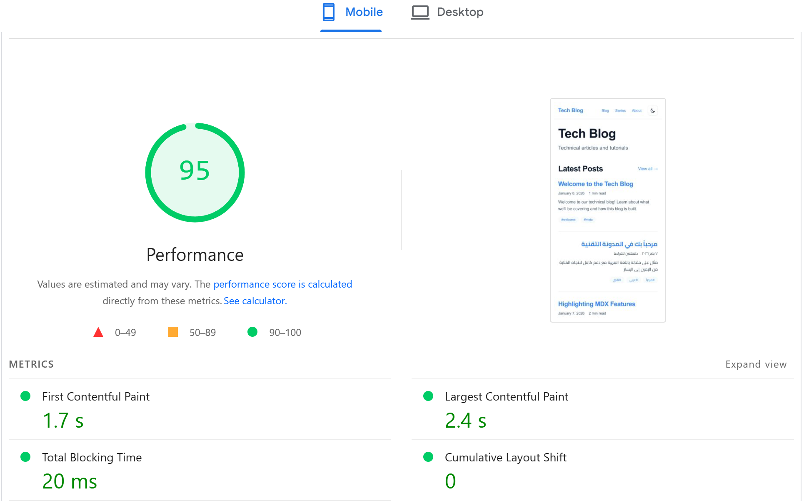

# Features Showcase

This document demonstrates the core capabilities of this blog framework with usage examples and technical details.

---

## 🚀 Quick Setup

### Time to First Blog Post

```bash
# Clone and setup
git clone https://github.com/YOUR-USERNAME/next-ssg-for-md-blog.git
cd next-ssg-for-md-blog
npm install

# Edit config
nano config.ts  # Change 3 lines

# Create first post
nano content/blog/hello-world.md

# Run
npm run dev

# Total time: ~5 minutes ⏱️
```

**Result**: A fully functional blog running at `localhost:3000`

---

## ⭐ Dual Deployment Modes

### 1. Standalone Website Mode

**What it is**: Traditional blog with full navigation, header, footer

**Build command**:

```bash
npm run build:standalone
```

**Output structure**:

```
out/
├── index.html              # Homepage with latest posts
├── blog/
│   ├── index.html          # Blog listing
│   ├── my-post/
│   │   └── index.html      # Full article page
├── tags/                   # Tag pages
├── series/                 # Series pages
└── _next/                  # Assets
```

**Use cases**:

- Personal blogs
- Company blogs
- Documentation sites
- Portfolio sites

### 2. Embeddable Content Mode ⭐

**What it is**: Pure HTML fragments without navigation or layout

**Build command**:

```bash
npm run build:embeddable
```

**Output structure**:

```
out/
├── blog/
│   ├── my-post/
│   │   ├── toc.html        # Table of Contents only
│   │   └── body.html       # Article content only
```

**Example output** (`body.html`):

```html
<!-- No <html>, <head>, <body>, navigation, header, or footer -->
<article class="prose dark:prose-invert">
  <h2 id="introduction">Introduction</h2>
  <p>This is the article content...</p>
  <!-- Just the content! -->
</article>
```

**Use cases**:

- Corporate dashboards showing blog posts
- Learning management systems (LMS)
- Internal wikis
- Admin panels
- Content management systems (CMS)
- Mobile apps

**Real-world example**:

```javascript
// In your React dashboard
import { useEffect, useState } from "react";

function BlogPostWidget({ postSlug }) {
  const [content, setContent] = useState("");

  useEffect(() => {
    // Fetch the embeddable content
    fetch(`/blog-content/${postSlug}/body.html`)
      .then((res) => res.text())
      .then((html) => setContent(html));
  }, [postSlug]);

  return <div className="dashboard-widget" dangerouslySetInnerHTML={{ __html: content }} />;
}
```

**Why this helps**: Allows you to integrate blog content into existing non-blog applications without setting up a CMS API.

---

## 🌍 First-Class RTL Support

### Automatic Direction Detection


**English post** (auto-detected as LTR):

```markdown
---
title: "Getting Started with React"
date: "2026-01-09"
---

React is a JavaScript library...
```

**Arabic post** (auto-detected as RTL):

```markdown
---
title: "البداية مع React"
date: "2026-01-09"
---

React هي مكتبة JavaScript...
```

**Result**: Automatic RTL layout, proper Arabic font, mirrored UI elements

### Per-Post Language Control

```markdown
---
title: "Mixed Content Post"
language: "ar" # Force RTL even if content is mixed
---

This post has عربي mixed with English.
```

### What Gets RTL Treatment

✅ Text direction (right-to-left)  
✅ Lists (bullets on the right)  
✅ Blockquotes (border on the right)  
✅ Tables (columns reversed)  
✅ Navigation (menu items right-aligned)  
✅ Padding/margins (mirrored)  
✅ Icons and indicators  
❌ Code blocks (always LTR - as they should be!)

### Typography

**Arabic font**: Cairo (clean, modern, readable)  
**Weights**: 400, 500, 600, 700  
**Automatic**: Switches between Latin and Arabic based on content

**Why this helps**: content creators can focus on writing without worrying about CSS mirroring or layout configurations.

---

## 📚 Series Navigation

### Creating a Series

**Folder structure**:

```
content/blog/
├── react-fundamentals/        # Series name
│   ├── 01-introduction.md
│   ├── 02-components.md
│   └── 03-hooks.md
├── standalone-post.md         # Not in a series
```

**Alternative: Explicit series**:

```markdown
---
title: "React Hooks Deep Dive"
series: "React Fundamentals" # Override folder name
seriesOrder: 3 # Explicit ordering
---
```

### What You Get


**Series listing page** (`/series`):

- All series with article counts
- First post previews
- Organized by series

**Series detail page** (`/series/react-fundamentals`):

- All posts in order
- Progress indicators
- Sequential navigation

**On each post**:

- Series badge (e.g., "Part 3 of React Fundamentals")
- Previous/Next navigation within series
- Link to series overview

### Real-world Example

**Course content**:

```
content/blog/
├── javascript-basics/
│   ├── 01-variables.md
│   ├── 02-functions.md
│   ├── 03-objects.md
│   ├── 04-arrays.md
│   └── 05-async.md
├── react-advanced/
│   ├── 01-context.md
│   ├── 02-performance.md
│   └── 03-patterns.md
```

**Navigation on each post**:

```
← Previous: Functions | Next: Arrays →
Part 3 of JavaScript Basics (5 posts)
```

---

## 🎨 Theme Customization

### Change Colors (30 seconds)

**Edit `src/app/globals.css`**:

```css
@theme {
  --color-primary: #10b981; /* Green */
  --color-accent: #14b8a6; /* Teal */
}

.dark {
  --color-primary: #34d399; /* Lighter green */
  --color-accent: #2dd4bf; /* Lighter teal */
}
```

**Result**: Entire blog updates to new color scheme instantly

### Popular Themes

**Tech/Professional** (default):

```css
--color-primary: #3b82f6; /* Blue */
--color-accent: #8b5cf6; /* Purple */
```

**Nature/Eco**:

```css
--color-primary: #10b981; /* Green */
--color-accent: #14b8a6; /* Teal */
```

**Creative/Bold**:

```css
--color-primary: #ec4899; /* Pink */
--color-accent: #f97316; /* Orange */
```

**Minimal/Elegant**:

```css
--color-primary: #64748b; /* Slate */
--color-accent: #6366f1; /* Indigo */
```

---

## 🔍 Search Functionality

### Features

✅ **Client-side**: No server or API required  
✅ **Fast**: Fuzzy search with Fuse.js  
✅ **Smart**: Searches title, description, content, tags  
✅ **Instant**: Real-time results as you type  
✅ **Keyboard-friendly**: Arrow keys + Enter navigation

### Usage


**Search box** on every page (top right)  
**Keyboard shortcut**: `Ctrl+K` or `Cmd+K`  
**Results**: Live filtering of blog posts

---

## 🌙 Dark Mode

### Features

✅ **Persistent**: Remembers your preference  
✅ **System-aware**: Respects OS preference on first visit  
✅ **Smooth transitions**: Animated color changes  
✅ **Complete coverage**: All components support both modes

### How it Works

1. **First visit**: Checks system preference
2. **Manual toggle**: Click sun/moon icon
3. **Persistence**: Saves to `localStorage`
4. **Next visit**: Loads saved preference

**No flash**: Theme applied before React hydration

---

## 📝 MDX Support

### Interactive Components

**Create `content/blog/interactive-demo.mdx`**:

```mdx
---
title: "Interactive React Demo"
date: "2026-01-09"
---

import { useState } from "react";

export function Counter() {
  const [count, setCount] = useState(0);
  return <button onClick={() => setCount(count + 1)}>Clicked {count} times</button>;
}

## Try it!

<Counter />
```

**Result**: Live React component embedded in your blog post!

---

## 🏆 Performance

### Lighthouse Scores (Production)


```
🟢 Performance:   95/100
🟢 Accessibility: 95/100
🟢 Best Practices: 96/100
🟢 SEO:          100/100
```

### Metrics



- **First Contentful Paint**: 1.7s
- **Largest Contentful Paint**: 2.4s
- **Total Blocking Time**: 20ms
- **Cumulative Layout Shift**: 0

### Bundle Size

~195 kB (First Load JS)

**Note**: Actual size depends on the number of interactive components used in your specific deployment.

---

## 🛠️ Developer Experience

### Fast Hot Reload

**Edit a post**:

```bash
# Terminal 1
npm run dev

# Terminal 2
nano content/blog/my-post.md
# Make changes, save
```

**Result**: Browser updates in < 1 second ⚡

### TypeScript Autocomplete

**In your editor**:

```typescript
import { Post } from "@/types";

const post: Post = {
  title: "...", // ✅ Autocomplete!
  date: "...", // ✅ Type checking!
  // ...          // ✅ Inline docs!
};
```

### Clear Error Messages

**Bad frontmatter**:

```yaml
---
title: "My Post"
date: invalid-date # 💈 Error!
---
```

**Error message**:

```
Error in content/blog/my-post.md:
Invalid date format: 'invalid-date'
Expected: YYYY-MM-DD (e.g., 2026-01-09)
```

---

## 📦 Build Modes Comparison

| Feature         | Standalone   | Embeddable      |
| --------------- | ------------ | --------------- |
| Full HTML pages | ✅           | ❌              |
| Navigation      | ✅           | ❌              |
| Header/Footer   | ✅           | ❌              |
| Pure content    | ❌           | ✅              |
| ToC separate    | ❌           | ✅              |
| Embeddable      | ❌           | ✅              |
| Use case        | Blog website | Dashboards, CMS |

---

## 🔥 Key Features Summary

1. **Embeddable Content Mode** - Generates pure HTML fragments for external use
2. **First-Class RTL Support** - Automatic detection and layout mirroring
3. **Series Navigation** - Folder-based organization with sequence controls
4. **Dual Build Modes** - Standalone site or embeddable snippets
5. **High Performance** - Optimized for Core Web Vitals
6. **Quick Setup** - Minimal configuration required to start writing

---

**Try it yourself**: [Live Demo](https://next-ssg-for-md-blog.vercel.app/)
